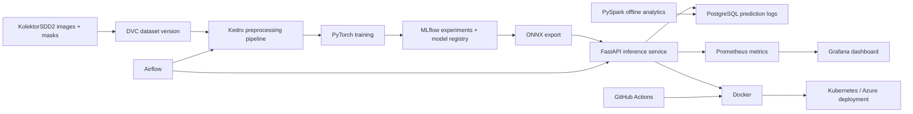

# FactoryVision

## Production-Grade Surface Defect Segmentation & MLOps Platform

FactoryVision is an end-to-end industrial visual-inspection system for detecting and segmenting manufacturing surface defects. The project covers the complete machine-learning lifecycle:

**data versioning -> preprocessing -> GPU training -> evaluation -> experiment tracking -> model registry -> optimized serving -> batch inference -> deployment -> monitoring**

The target outcome is a reproducible, production-oriented computer-vision platform rather than an isolated research notebook.

> This README describes the complete target system. Metrics, benchmarks, deployment endpoints, and screenshots will be added as they are produced.

## Project goals

- Train a PyTorch segmentation model for industrial surface defects.
- Version datasets and models for reproducible experiments.
- Expose real-time and batch inference through production-style services.
- Persist prediction records for SQL and offline analytics.
- Containerize and deploy the system locally and to cloud infrastructure.
- Monitor service health, inference performance, and model/business metrics.
- Demonstrate software engineering practices including testing, CI/CD, orchestration, and observability.

## Problem and dataset

FactoryVision targets pixel-level industrial defect inspection using the [KolektorSDD2 dataset](https://www.vicos.si/resources/kolektorsdd2/). The system will produce:

- a predicted defect mask;
- a defect/no-defect score;
- a derived bounding box;
- segmentation and defect-level evaluation metrics.

The initial model will be a PyTorch U-Net or DeepLabV3 implementation. The project prioritizes reproducibility and production integration over adding multiple deep-learning frameworks or unnecessarily novel architectures.

## Dataset examples

These are raw dataset inputs before model inference. The left image shows representative defect types from the official dataset overview; the right image is a defect-free training sample. The model will learn to distinguish these cases and, for defective inputs, produce a pixel-level mask.

<table>
  <tr>
    <th>Defect examples</th>
    <th>Non-defect example</th>
  </tr>
  <tr>
    <td>
      
    </td>
    <td>
      
    </td>
  </tr>
  <tr>
    <td>Scratches, spots, and other surface imperfections.</td>
    <td>A surface image labeled without a visible defect.</td>
  </tr>
</table>

The defect overview image is provided by [ViCoS Lab](https://www.vicos.si/resources/kolektorsdd2/). The non-defect sample is from a [KolektorSDD2 dataset mirror](https://huggingface.co/datasets/sizhkhy/kolektor_sdd2) and is stored locally so the example renders reliably on GitHub. Dataset usage remains subject to the original [CC BY-NC-SA 4.0 license](https://creativecommons.org/licenses/by-nc-sa/4.0/).

## Architecture



## Technology stack

| Area | Technologies and concepts |
| --- | --- |
| Computer vision / ML | Python, PyTorch, OpenCV, GPU training |
| Model architecture | U-Net, DeepLabV3, semantic segmentation, defect detection |
| Data engineering | Kedro, DVC, Pandas, PySpark, SQL, PostgreSQL |
| Experiment lifecycle | MLflow, experiment tracking, model registry, reproducibility |
| Model serving | FastAPI, ONNX, ONNX Runtime, REST API |
| Batch orchestration | Apache Airflow, scheduled inference, data validation |
| Packaging and platform | Docker, Docker Compose, Kubernetes, Azure |
| CI/CD | GitHub Actions, GitHub Container Registry, automated tests |
| Observability | Prometheus, Grafana, latency, throughput, error rate, defect rate |
| Edge / systems stretch | C++, OpenCV, ONNX Runtime, inference optimization |

## Inference API

The FastAPI service will provide:

| Endpoint | Purpose |
| --- | --- |
| `POST /predict` | Accept an image and return a defect mask, probability, and bounding box |
| `GET /health` | Liveness and service health check |
| `GET /model-info` | Model version, evaluation metrics, and runtime metadata |

The service will include request validation, clear error responses, automated `pytest` tests, and a comparison between PyTorch and ONNX Runtime inference.

## Evaluation and performance

Model quality will be reported with:

- Dice score;
- Intersection over Union (IoU);
- precision and recall;
- defect-level F1 score;
- qualitative prediction overlays.

Serving performance will be benchmarked with:

- model size;
- mean inference latency;
- p50 and p95 latency;
- throughput;
- error rate.

## Observability

Prometheus metrics and Grafana dashboards will cover:

- request count and error rate;
- inference latency histograms;
- throughput;
- current model version;
- predicted defect rate;
- service and model/business health.

Prediction logs will be stored in PostgreSQL with image ID, timestamp, model version, defect score, prediction latency, and status. A small PySpark job will compute daily statistics by model version and defect status.

## Implementation roadmap

### Data, repository, and baseline model

- Set up the project structure, Python environment, and pinned dependencies.
- Download KolektorSDD2 and track it with DVC; raw data does not belong in Git.
- Build an exploratory data-analysis notebook.
- Train a first PyTorch U-Net or DeepLabV3 baseline.
- Report segmentation and defect-level metrics with prediction overlays.

### Reproducible training

- Convert ingestion, preprocessing, training, and evaluation into Kedro nodes and pipelines.
- Add configuration for paths, augmentations, seeds, model settings, and hyperparameters.
- Track parameters, metrics, artifacts, and example predictions in MLflow.
- Register the best model as `factoryvision-segmentation`.
- Run three to five comparable experiments.

### Real-time inference and ONNX optimization

- Export the best model to ONNX.
- Benchmark PyTorch against ONNX Runtime.
- Implement and test the FastAPI inference service.
- Add request validation, health checks, model metadata, and error handling.
- Optionally implement a C++/OpenCV/ONNX Runtime inference executable.

### Batch inference and data processing

- Store prediction metadata and results in PostgreSQL.
- Create an Airflow DAG for discovery, validation, batch inference, persistence, and summary generation.
- Add PySpark offline analytics for daily prediction statistics.

### Containers, Kubernetes, and monitoring

- Build a multi-stage Docker image.
- Add Docker Compose for the API, PostgreSQL, MLflow, Prometheus, and Grafana.
- Create Kubernetes Deployment, Service, ConfigMap, and resource-limit manifests.
- Run the stack locally with kind, k3d, or minikube.

### CI/CD and deployment

- Add a GitHub Actions pipeline for linting, tests, and Docker builds.
- Push successful images to GitHub Container Registry.
- Deploy the FastAPI container to Azure Container Apps or another simple Azure target.
- Document secrets, environment variables, load-test results, and rollback procedures.

### Portfolio and release readiness

- Complete the README, architecture diagram, results, screenshots, and demo.
- Add a Model Card and Data Card covering intended use, limitations, and failure modes.
- Add representative input/prediction examples.
- Record a short flow from image upload to API prediction, Grafana metrics, and MLflow run.
- Add a Makefile or task runner and create the `v1.0.0` GitHub release.
- Optionally generate a daily inspection report from structured batch metrics using an LLM downstream of the computer-vision predictions.

## Project capabilities

### Primary platform capabilities

PyTorch segmentation, DVC, Kedro, MLflow, FastAPI, SQL/PostgreSQL, Airflow, Docker, Prometheus/Grafana, GitHub Actions, and one deployment target.

### Extended capabilities

PySpark, local Kubernetes, C++ ONNX inference, edge-runtime optimization, and LLM-generated inspection reports.

A complete, documented production pipeline is more valuable than touching many tools superficially.

## Repository structure

```text
factoryvision-mlops/
|-- .github/workflows/ci.yml
|-- configs/
|-- conf/base/             # Kedro parameters and catalog configuration
|-- data/                  # DVC pointers only
|-- docker/
|-- k8s/
|-- notebooks/
|-- src/factoryvision/
|   |-- data/
|   |-- pipelines/baseline/ # Kedro nodes and pipeline definition
|   |-- training/
|   |-- inference/
|   |-- api/
|   `-- monitoring/
|-- airflow/dags/
|-- spark/
|-- tests/
|-- dvc.yaml
|-- docker-compose.yml
|-- Makefile
|-- pyproject.toml
|-- MODEL_CARD.md
`-- README.md
```

## Project commands

```bash
kedro run
make train
make serve
make test
make docker
make k8s
```

These are the intended developer entry points for the corresponding components.

## Kedro configuration

The baseline pipeline reads its experiment settings from `conf/base/parameters.yml`.
The sections are intentionally separated by responsibility:

| Section | Controls |
| --- | --- |
| `dataset` | DVC manifest path and target image dimensions |
| `augmentation` | Training-only image/mask transforms and their probabilities |
| `model` | U-Net input channels, output channels, and base feature width |
| `training` | Seed, deterministic mode, device, optimizer, loss, batch size, epochs, and output directory |
| `evaluation` | Probability threshold and qualitative examples per class |

Edit those YAML values before running `kedro run`; the Python pipeline code does not need to change for ordinary experiments. Training augmentations are applied to the image and mask together, while validation augmentations are disabled so evaluation remains comparable across runs. Machine-specific overrides can be placed in `conf/local/`.

## MLflow experiment tracking

Kedro training runs are tracked locally with MLflow. The tracking configuration is in the `tracking` section of `conf/base/parameters.yml`; the default backend is the SQLite database `artifacts/mlflow.db`, and generated artifacts remain under the ignored `artifacts/` directory.

Run the pipeline to create an experiment run:

```powershell
.venv\Scripts\kedro.exe run
```

Start the local MLflow UI in a second terminal:

```powershell
.venv\Scripts\mlflow.exe ui --backend-store-uri sqlite:///artifacts/mlflow.db
```

Then open `http://127.0.0.1:5000`. Each run contains the flattened configuration parameters, per-epoch losses and metrics, the best checkpoint, the training history/configuration files, and the validation prediction overlay.

To run the controlled mini-study, use the same split, seed, and epoch budget for each configuration:

```powershell
.venv\Scripts\python.exe scripts\run_mini_study.py --limit 3 --epochs 2
```

The study compares the baseline, a lower learning rate, and a balanced BCE/Dice loss. It selects the winner by final IoU, using defect-level F1 as a tie-breaker, and writes the comparison to `artifacts/mini-study/results.csv`.

Mini-study snapshot, using two epochs on CUDA with the same seed and official split:

| Configuration | Learning rate | BCE/Dice weights | Final IoU | Final Dice | Defect F1 |
| --- | ---: | ---: | ---: | ---: | ---: |
| Baseline | 0.001 | 0.25 / 0.75 | 0.0489 | 0.0932 | 0.5029 |
| Lower learning rate | 0.0003 | 0.25 / 0.75 | 0.0155 | 0.0306 | 0.3896 |
| Balanced loss | 0.001 | 0.50 / 0.50 | 0.0211 | 0.0413 | 0.2623 |

The baseline was selected by final IoU. These are deliberately short comparison runs, so the winner is a candidate for a longer training run rather than a final quality claim.

## MLflow Model Registry

The selected mini-study winner can be registered as the versioned MLflow model `factoryvision-segmentation`:

```powershell
.venv\Scripts\python.exe scripts\register_best_model.py
```

The script reads `artifacts/mini-study/winner.json`, retrieves that run's tracked `model/best.pt` artifact, rebuilds the U-Net from the run's logged architecture parameters, and logs the complete PyTorch model with an input/output signature. MLflow then creates a model version in the local registry stored in `artifacts/mlflow.db` and assigns the version the `candidate` alias.

The registered model can be loaded by alias:

```python
import mlflow.pytorch

model = mlflow.pytorch.load_model(
    "models:/factoryvision-segmentation@candidate"
)
```

The alias identifies the currently selected candidate without putting model binaries in Git. The registration is intentionally local for now; the MLflow database and model artifacts are ignored by Git and can later be moved to a shared MLflow server or artifact store.

## Reproducibility

FactoryVision uses explicit configuration and deterministic seed handling so experiments can be repeated consistently.

### Reproduce the baseline run

Use Python 3.11 and install the project dependencies:

```powershell
.venv\Scripts\python.exe -m pip install -e ".[dev]"
```

Restore the DVC-tracked dataset and verify that the reusable split manifest exists:

```powershell
.venv\Scripts\dvc.exe pull
```

```text
data/processed/splits.csv
```

The training configuration is in `conf/base/parameters.yml`. The important reproducibility settings are:

```yaml
training:
  seed: 42
  deterministic: true
  device: cuda
```

Run the complete Kedro pipeline:

```powershell
.venv\Scripts\kedro.exe run
```

The run produces training and validation losses, segmentation metrics, the best checkpoint, validation prediction overlays, and an MLflow experiment run.

### What is made deterministic?

The configured seed is applied to Python's random number generator, NumPy, PyTorch, CUDA, DataLoader workers, and the weighted training sampler. When `deterministic: true`, PyTorch also requests deterministic algorithm behavior where supported.

### What is recorded?

Each MLflow run records the dataset manifest, image size, model architecture, learning rate, loss weights, batch size, epoch count, seed, and selected device. It also stores the training history, best checkpoint, configuration file, and validation prediction examples.

### Reproducibility limitations

Deterministic settings improve repeatability but do not guarantee identical results across every machine. Small differences may still occur because of different PyTorch or CUDA versions, GPU hardware, CPU versus GPU execution, unsupported nondeterministic operations, or changes to the dataset and split manifest.

For the closest comparison, use the same Python version, dependency versions, dataset manifest, seed, image size, device type, and hyperparameters.

## Definition of done

- A fresh clone can reproduce training or inference from documented commands.
- Dataset and model versions are explicit.
- At least three experiments are visible in MLflow.
- Metrics and example predictions are published in the README.
- The API has automated tests.
- The Docker image builds in GitHub Actions.
- Batch inference is orchestrated by Airflow.
- Predictions are persisted in SQL.
- Grafana displays live service and model metrics.
- An ONNX benchmark is included.
- Cloud or Kubernetes deployment is demonstrated.
- The README includes the architecture and a short demo.

## Portfolio summary

FactoryVision demonstrates the full lifecycle of an applied computer-vision system: data engineering, segmentation, evaluation, experiment tracking, model versioning, optimized inference, APIs, batch orchestration, deployment, CI/CD, and observability.

The project is designed to complement research-heavy computer-vision experience with practical production ML and MLOps engineering.
