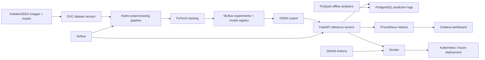

# FactoryVision

## Production-Grade Surface Defect Segmentation & MLOps Platform

FactoryVision is an end-to-end industrial visual-inspection system for detecting and segmenting manufacturing surface defects. The project covers the complete machine-learning lifecycle:

**data versioning -> preprocessing -> GPU training -> evaluation -> experiment tracking -> model registry -> optimized serving -> batch inference -> deployment -> monitoring**

The target outcome is a reproducible, production-oriented computer-vision platform rather than an isolated research notebook.

> Implementation follows a staged seven-day plan. Metrics, benchmarks, deployment endpoints, and screenshots will be added as they are produced.

## Project goals

- Train a PyTorch segmentation model for industrial surface defects.
- Version datasets and models for reproducible experiments.
- Expose real-time and batch inference through production-style services.
- Persist prediction records for SQL and offline analytics.
- Containerize and deploy the system locally and to cloud infrastructure.
- Monitor service health, inference performance, and model/business metrics.
- Demonstrate software engineering practices including testing, CI/CD, orchestration, and observability.

## Problem and dataset

FactoryVision targets pixel-level industrial defect inspection using the [KolektorSDD2 dataset](https://www.vicos.si/resources/kolektorsdd2/). The system will produce:

- a predicted defect mask;
- a defect/no-defect score;
- a derived bounding box;
- segmentation and defect-level evaluation metrics.

The initial model will be a PyTorch U-Net or DeepLabV3 implementation. The project prioritizes reproducibility and production integration over adding multiple deep-learning frameworks or unnecessarily novel architectures.

## Planned architecture



## Target technology stack

| Area | Technologies and concepts |
| --- | --- |
| Computer vision / ML | Python, PyTorch, OpenCV, GPU training |
| Model architecture | U-Net, DeepLabV3, semantic segmentation, defect detection |
| Data engineering | Kedro, DVC, Pandas, PySpark, SQL, PostgreSQL |
| Experiment lifecycle | MLflow, experiment tracking, model registry, reproducibility |
| Model serving | FastAPI, ONNX, ONNX Runtime, REST API |
| Batch orchestration | Apache Airflow, scheduled inference, data validation |
| Packaging and platform | Docker, Docker Compose, Kubernetes, Azure |
| CI/CD | GitHub Actions, GitHub Container Registry, automated tests |
| Observability | Prometheus, Grafana, latency, throughput, error rate, defect rate |
| Edge / systems stretch | C++, OpenCV, ONNX Runtime, inference optimization |

## Inference API

The planned FastAPI service will provide:

| Endpoint | Purpose |
| --- | --- |
| `POST /predict` | Accept an image and return a defect mask, probability, and bounding box |
| `GET /health` | Liveness and service health check |
| `GET /model-info` | Model version, evaluation metrics, and runtime metadata |

The service will include request validation, clear error responses, automated `pytest` tests, and a comparison between PyTorch and ONNX Runtime inference.

## Evaluation and performance

Model quality will be reported with:

- Dice score;
- Intersection over Union (IoU);
- precision and recall;
- defect-level F1 score;
- qualitative prediction overlays.

Serving performance will be benchmarked with:

- model size;
- mean inference latency;
- p50 and p95 latency;
- throughput;
- error rate.

## Observability

Prometheus metrics and Grafana dashboards will cover:

- request count and error rate;
- inference latency histograms;
- throughput;
- current model version;
- predicted defect rate;
- service and model/business health.

Prediction logs will be stored in PostgreSQL with image ID, timestamp, model version, defect score, prediction latency, and status. A small PySpark job will compute daily statistics by model version and defect status.

## Seven-day delivery plan

### Day 1 - Dataset, repository, and baseline model

- Set up the project structure, Python environment, and pinned dependencies.
- Download KolektorSDD2 and track it with DVC; raw data does not belong in Git.
- Build an exploratory data-analysis notebook.
- Train a first PyTorch U-Net or DeepLabV3 baseline.
- Report segmentation and defect-level metrics with prediction overlays.

### Day 2 - Reproducible training

- Convert ingestion, preprocessing, training, and evaluation into Kedro nodes and pipelines.
- Add configuration for paths, augmentations, seeds, model settings, and hyperparameters.
- Track parameters, metrics, artifacts, and example predictions in MLflow.
- Register the best model as `factoryvision-segmentation`.
- Run three to five comparable experiments.

### Day 3 - Real-time inference and ONNX

- Export the best model to ONNX.
- Benchmark PyTorch against ONNX Runtime.
- Implement and test the FastAPI inference service.
- Add request validation, health checks, model metadata, and error handling.
- Optionally implement a C++/OpenCV/ONNX Runtime inference executable.

### Day 4 - Batch inference and data processing

- Store prediction metadata and results in PostgreSQL.
- Create an Airflow DAG for discovery, validation, batch inference, persistence, and summary generation.
- Add PySpark offline analytics for daily prediction statistics.

### Day 5 - Containers, Kubernetes, and monitoring

- Build a multi-stage Docker image.
- Add Docker Compose for the API, PostgreSQL, MLflow, Prometheus, and Grafana.
- Create Kubernetes Deployment, Service, ConfigMap, and resource-limit manifests.
- Run the stack locally with kind, k3d, or minikube.

### Day 6 - CI/CD and deployment

- Add a GitHub Actions pipeline for linting, tests, and Docker builds.
- Push successful images to GitHub Container Registry.
- Deploy the FastAPI container to Azure Container Apps or another simple Azure target.
- Document secrets, environment variables, load-test results, and rollback procedures.

### Day 7 - Portfolio release

- Complete the README, architecture diagram, results, screenshots, and demo.
- Add a Model Card and Data Card covering intended use, limitations, and failure modes.
- Add representative input/prediction examples.
- Record a short flow from image upload to API prediction, Grafana metrics, and MLflow run.
- Add a Makefile or task runner and create the `v1.0.0` GitHub release.
- Optionally generate a daily inspection report from structured batch metrics using an LLM downstream of the computer-vision predictions.

## Core scope and stretch scope

### Core

PyTorch segmentation, DVC, Kedro, MLflow, FastAPI, SQL/PostgreSQL, Airflow, Docker, Prometheus/Grafana, GitHub Actions, and one deployment target.

### Stretch

PySpark, local Kubernetes, C++ ONNX inference, edge-runtime optimization, and LLM-generated inspection reports.

A complete, documented production pipeline is more valuable than touching many tools superficially.

## Repository structure

```text
factoryvision-mlops/
|-- .github/workflows/ci.yml
|-- configs/
|-- data/                  # DVC pointers only
|-- docker/
|-- k8s/
|-- notebooks/
|-- src/factoryvision/
|   |-- data/
|   |-- training/
|   |-- inference/
|   |-- api/
|   `-- monitoring/
|-- airflow/dags/
|-- spark/
|-- tests/
|-- dvc.yaml
|-- docker-compose.yml
|-- Makefile
|-- pyproject.toml
|-- MODEL_CARD.md
`-- README.md
```

## Planned commands

```bash
make train
make serve
make test
make docker
make k8s
```

The exact commands will become authoritative once the corresponding components are implemented.

## Definition of done

- A fresh clone can reproduce training or inference from documented commands.
- Dataset and model versions are explicit.
- At least three experiments are visible in MLflow.
- Metrics and example predictions are published in the README.
- The API has automated tests.
- The Docker image builds in GitHub Actions.
- Batch inference is orchestrated by Airflow.
- Predictions are persisted in SQL.
- Grafana displays live service and model metrics.
- An ONNX benchmark is included.
- Cloud or Kubernetes deployment is demonstrated.
- The README includes the architecture and a short demo.

## Portfolio summary

FactoryVision demonstrates the full lifecycle of an applied computer-vision system: data engineering, segmentation, evaluation, experiment tracking, model versioning, optimized inference, APIs, batch orchestration, deployment, CI/CD, and observability.

The project is designed to complement research-heavy computer-vision experience with practical production ML and MLOps engineering.

