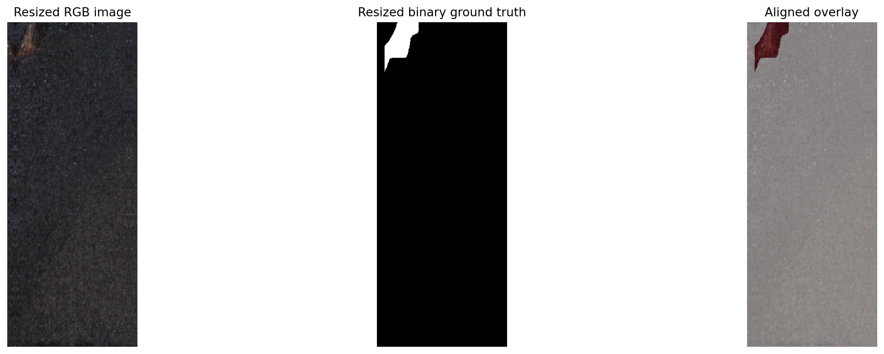

# Dataset loader and smoke test

This folder contains the first PyTorch data-loading component:

- dataset.py defines KolektorSDD2Dataset.
- smoke_test.py loads one defective training sample, prints its tensor properties, and saves a visual check.
- dataset_smoke_test.png shows the resized image, resized ground-truth mask, and their overlay.

## How the loader works

The loader reads data/processed/splits.csv. Each row contains a repository-relative image path, mask path, class, and split assignment.

For each sample, it:

1. Reads the image in OpenCV BGR format.
2. Converts it to RGB.
3. Resizes the image and mask proportionally into a 640 x 256 canvas.
4. Uses bilinear interpolation for the image and nearest-neighbor interpolation for the mask.
5. Adds symmetric padding where needed so the original tall, narrow geometry is not stretched into a wide image.
6. Converts the image to a PyTorch tensor with channel-first shape.
7. Scales image values from 0..255 to 0..1.
8. Converts every nonzero mask pixel to 1 and every background pixel to 0.

Nearest-neighbor interpolation is important for masks. Bilinear interpolation could create fractional labels at defect boundaries, which would no longer be clean ground-truth targets.

## Smoke-test result

Run from the repository root:

    .venv\Scripts\python.exe -m factoryvision.data.smoke_test

The smoke test reports:

    image shape: (3, 640, 256)
    mask shape: (1, 640, 256)
    image dtype: torch.float32
    mask dtype: torch.float32
    image value range: (0.03921568766236305, 0.8235294222831726)
    mask unique values: [0.0, 1.0]
    mask defect pixels: 3334

The smoke test used the defective sample data/raw/kolektor-sdd2/train/10021.png. Image size is written as (height, width), so the loader output is 640 pixels tall and 256 pixels wide. The exact image minimum, maximum, and defect-pixel count can vary by sample, but the image is always represented as float32 values in the [0, 1] range. The mask is always a binary float32 tensor.

## Visual alignment after resizing

The image and mask are resized to the same target dimensions. The overlay below should show the red mask region directly on top of the visible defect. This confirms that the image and ground truth remain spatially aligned after preprocessing.

The loader returns an image and a mask. A future training loop can pass the image to a segmentation model and compare the model prediction with this ground-truth mask.
